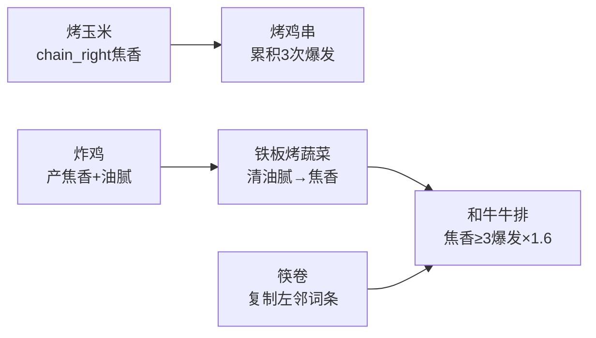
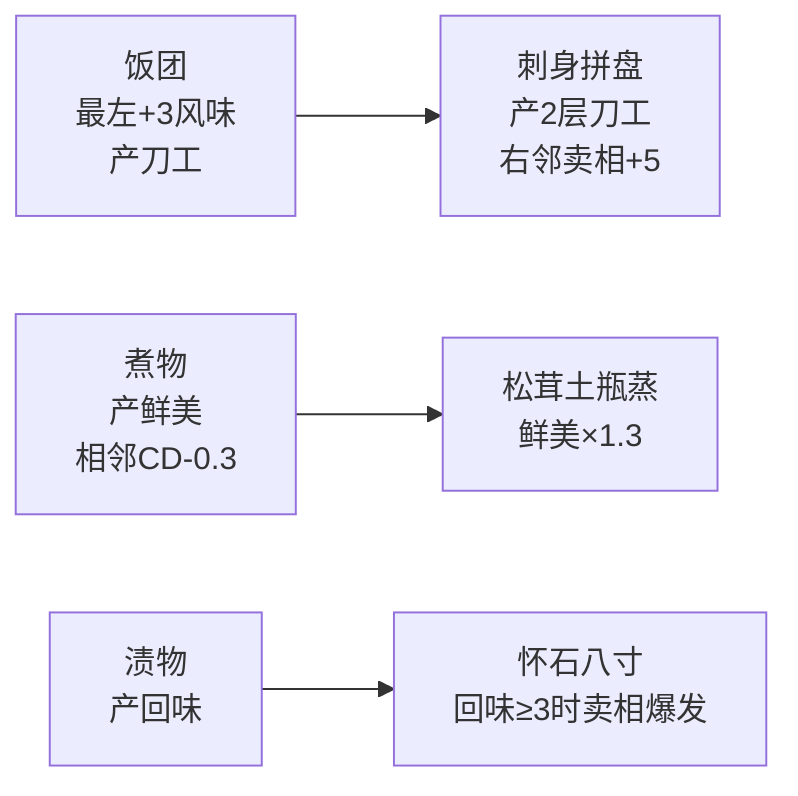
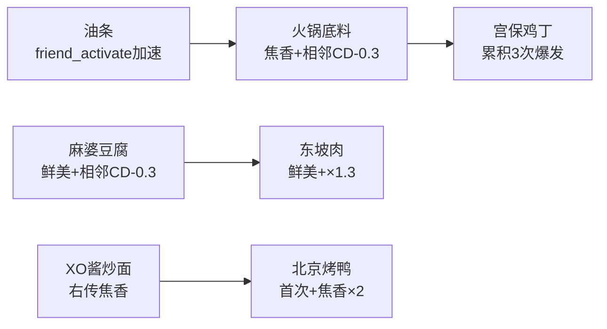

# 菜品效果重设计规格文档（V2）

> 更新日期：2026-02-21
> 参考来源：当前代码库分析 + The Bazaar 大巴扎实际设计经验

---

## 一、设计哲学：从"大巴扎"中学到了什么

### 1.1 The Bazaar 的核心设计原则

通过研究 The Bazaar（Steam 上的多人 Roguelike 自走棋），总结其经过数万玩家验证的核心设计原则：

| 原则 | 大巴扎做法 | 我们的对应 |
|------|-----------|-----------|
| **冷却即核心** | 所有物品自动按CD激活，Haste/Charge/Freeze围绕CD做文章 | 我们的 `reduce_cooldown` / `haste` / `slow` 已具备，但菜品实际使用太少 |
| **相邻触发** | "When you use an adjacent item" 是最常见触发条件 | 已支持 `adjacent_activate` 事件，但当前仅0道菜使用 |
| **强制协同 vs 开放协同** | 强制协同=直接点名互动；开放协同=隐式互补 | 我们的菜系内连携=强制协同；跨菜系词条共享=开放协同 |
| **反制三角** | Poison→Shield→Weapon→Poison 形成三角 | 我们的 焦香攻击→油腻惩罚→清口解除 可形成三角 |
| **渐进复杂度** | 低稀有=简单效果，高稀有=条件组合 | 对应 Tier 0=单一效果，Tier 3=多条件引爆器 |

### 1.2 当前项目的核心问题

通过审计全部 ~170 道菜品数据，发现以下问题：

| 问题 | 数量 | 占比 |
|------|------|------|
| **无触发效果**（triggers为空） | 5 道 | ~3% |
| **单纯堆词条**（仅 `add_keyword X stacks N`） | ~60 道 | ~35% |
| **同质化严重**（同菜系内多道效果完全雷同） | ~25 组 | ~15% |
| **缺乏菜系间互动** | 几乎所有菜 | 100% |
| **CD操控效果使用率极低** | 仅 ~8 道 | ~5% |
| **相邻触发事件完全未使用** | 0 道 | 0% |

### 1.3 重设计的三条铁律

1. **每道菜至少一个非平凡触发**：不再允许"激活时获得1层X"作为唯一效果
2. **每个菜系3条以上连携链路**：菜品A的输出是菜品B的输入
3. **跨Tier递进**：低Tier是引擎（产出资源），高Tier是引爆器（消耗爆发）

---

## 二、系统能力盘点（已实现/可直接使用）

### 2.1 触发事件（TriggerSystem 已实现）

| 事件ID | 触发时机 | 当前菜品使用数 | 评估 |
|--------|---------|-------------|------|
| `self_activate` / `item_activated` | 自身激活时 | ~165 | ✅ 主力 |
| `self_first_activate` | 首次激活时 | ~12 | ✅ 正常 |
| `friend_activate` | 己方任意其他菜激活 | 0 | ⚠️ 完全未用 |
| `adjacent_activate` | 相邻菜品激活时 | 0 | ⚠️ 完全未用 |
| `left_activate` / `right_activate` | 左/右邻激活时 | 0 | ⚠️ 完全未用 |
| `any_activate` | 任意菜品激活 | 0 | ⚠️ 完全未用 |
| `keyword_gained` | 获得关键词时 | 工具专用 | 可引入菜品 |
| `environment_applied` | 环境词条添加时 | 0 | 可用于反制 |
| `showdown_start` | 对决开始时 | 工具专用 | 可用于开场 |
| `item_tick` | 每Tick | 工具专用 | 可用于持续 |

### 2.2 条件系统（已实现）

```
字符串条件：self, always, has_tag:X, cuisine:X, size:N, keyword:X, adjacent_X
字典条件：
  - if_keyword_gte: {keyword, stacks}     词条≥N层
  - if_position: leftmost/rightmost       位置条件
  - if_adjacent_has_tag: "tag"             相邻有标签
  - if_adjacent_count_gte: N              相邻≥N个
  - if_count_size: {size, min_count}      棋盘上特定尺寸≥N个
  - for_each_size / for_each_tag / for_each_left  按数量缩放
  - adjacent_has_all_tags: [tags]          相邻有全部标签
  - adjacent_has_id: "item_id"             相邻有特定菜品
```

### 2.3 效果系统（已实现）

| 效果类型 | 代码键 | 当前使用情况 |
|---------|--------|------------|
| **直接属性** | `flavor/presentation/technique/aroma` | ✅ 广泛 |
| **关键词增** | `add_keyword + keyword_stacks` | ✅ 主力 |
| **关键词减** | `consume_keyword` | ⚠️ 极少 |
| **环境增** | `add_environment + environment_stacks` | ✅ 部分 |
| **环境清** | `clear_environment + clear_amount` | ✅ 部分 |
| **风味倍率** | `flavor_mult: N` | ✅ 部分 |
| **卖相倍率** | `presentation_mult` | ⚠️ 极少 |
| **首次奖励** | `type: first_activate_bonus` | ✅ 部分 |
| **累积爆发** | `accumulate: {counter_id, threshold, on_threshold}` | ✅ 部分 |
| **条件爆发** | `if_keyword_gte → then/else` | ✅ 部分 |
| **位置条件** | `if_position → then/else` | ⚠️ 极少 |
| **相邻标签** | `if_adjacent_has_tag → then_bonus` | ✅ 部分 |
| **随机概率** | `random_chance → on_success` | ✅ 部分 |
| **链式传递** | `chain_left/chain_right: {range, effect}` | ✅ 部分 |
| **关键词转换** | `convert_keyword: {from, to, ratio}` | ⚠️ 极少 |
| **复制关键词** | `copy_adjacent_keyword: {target, keyword, stacks}` | ⚠️ 极少 |
| **延迟触发** | `delayed_trigger: {delay_ticks, effect}` | ⚠️ 数据预留 |
| **缩减自身CD** | `reduce_cooldown_self: N` | ⚠️ 极少 |
| **缩减相邻CD** | `reduce_cooldown_adjacent: N` | ✅ 部分 |
| **加速自身** | `haste: dur, haste_mult: N` | ⚠️ 未用 |
| **加速相邻** | `haste_adjacent: dur, haste_mult: N` | ⚠️ 未用 |
| **减速对手** | `slow: dur, slow_mult: N` | ⚠️ 未用 |
| **治疗声望** | `heal_prestige: N` | ⚠️ 极少 |
| **获得金币** | `grant_gold: N` | ⚠️ 极少 |

---

## 三、关键词生态重设计

### 3.1 当前关键词数值（KeywordManager 实际生效值）

| 增益关键词 | 每层效果 | 设计角色 |
|-----------|---------|---------|
| `umami`（鲜美） | flavor +3/层 | 通用增伤 |
| `char_aroma`（焦香） | flavor +2/层 | 攻击性增伤 |
| `plating`（摆盘） | presentation +3/层 | 卖相压制（DoT） |
| `knife_work`（刀工） | technique +2/层 | 全局倍率 |
| `aftertaste`（回味） | flavor ×(1+0.3×层) | 后期爆发 |
| `secret_recipe`（秘方） | flavor ×(1+0.5×层)，用后消耗 | 一次性爆弹 |
| `spotlight`（聚光） | 即时减CD 1.0s/层，用后消耗 | 节奏加速 |

| 环境关键词 | 每层效果 | 设计角色 |
|-----------|---------|---------|
| `greasy`（油腻） | flavor -2/层 | 负面惩罚 |
| `messy`（杂乱） | presentation -2/层 | 卖相惩罚 |
| `taste_fatigue`（味觉疲劳） | flavor ×max(0.1, 1-0.15×层) | 递减惩罚 |
| `dull`（沉闷） | CD +0.3s/层 | 节奏惩罚 |

### 3.2 关键词三角克制设计

参考 The Bazaar 的 Poison→Shield→Weapon 三角，建立我们的"调味三角":

```
       焦香/鲜美（进攻）
          ↗          ↘
    清口/解毒      油腻/疲劳
   （解除）  ←-------  （惩罚）
```

**设计原则**：
- **进攻方**（夜市/中华）：大量产出焦香/鲜美，但同时制造油腻
- **惩罚方**（油腻/疲劳）：自然积累，压低双方得分
- **解除方**（药膳/甜品/和食light标签）：清除负面词条并获取奖励

---

## 四、六大菜系重设计方案

### 🍢 夜市（Yatai）— 爆香连锁引擎

**核心主题**：焦香积累 → 阈值引爆 / 油腻双刃剑 / 烤物相邻互加速
**主力关键词**：`char_aroma`, `greasy`
**菜系关键词**：短CD快节奏，小菜为引擎，大菜为引爆器

#### 连携链路



#### 分Tier效果设计模板

| Tier | 设计密度 | 效果类型分布 |
|------|---------|------------|
| 0 (Bronze) | 1个触发 | 基础产出 + **1个副效应**（位置/概率/相邻条件） |
| 1 (Silver) | 1-2个触发 | 产出 + CD操控 或 条件加成 或 链式传递 |
| 2 (Gold) | 2个触发 | 阈值爆发 + 环境处理 + 相邻互动 |
| 3 (Diamond) | 2-3个触发 | 多条件引爆 + 全场影响 + 减速对手 |

#### Tier 0 重设计示例

```gdscript
# 烤鸡串 — 引擎型：累积+相邻加速（非单纯堆词条）
{
    "id": "yatai_yakitori",
    "triggers": [
        {
            "event": "item_activated", "condition": "self",
            "effect": {
                "add_keyword": "char_aroma", "keyword_stacks": 1,
                "accumulate": {
                    "counter_id": "sizzle_yatai_yakitori",
                    "increment": 1, "threshold": 3,
                    "reset_counter": true,
                    "on_threshold": {"flavor": 25, "reduce_cooldown_adjacent": 0.5}
                }
            },
            "desc": "获得1层焦香；每激活3次，爆发25风味并加速相邻0.5秒"
        }
    ]
}

# 章鱼烧 — 概率+链式（而非单纯add_keyword）
{
    "id": "yatai_takoyaki",
    "triggers": [
        {
            "event": "item_activated", "condition": "self",
            "effect": {
                "add_keyword": "char_aroma", "keyword_stacks": 1,
                "random_chance": 0.35,
                "on_success": {
                    "chain_right": {"range": 1, "effect": {"add_keyword": "plating", "keyword_stacks": 1}},
                    "reduce_cooldown_self": 0.5
                }
            },
            "desc": "获得1层焦香；35%概率向右传递摆盘并自身CD-0.5秒"
        }
    ]
}

# 烤红薯 — 延迟触发型（大巴扎风格的Charge机制）
{
    "id": "yaki_imo",
    "triggers": [
        {
            "event": "item_activated", "condition": "self",
            "effect": {
                "add_keyword": "aftertaste", "keyword_stacks": 1,
                "delayed_trigger": {
                    "delay_ticks": 20,
                    "effect": {"add_keyword": "aftertaste", "keyword_stacks": 2, "flavor": 10}
                }
            },
            "desc": "获得1层回味；2秒后额外获得2层回味和10风味"
        }
    ]
}
```

#### Tier 3 重设计示例（引爆器）

```gdscript
# 岩浆烧烤 — 终极引爆器
{
    "id": "magma_grill",
    "triggers": [
        {
            "event": "item_activated", "condition": "self",
            "effect": {
                "if_keyword_gte": {"keyword": "char_aroma", "stacks": 5},
                "then": {
                    "consume_keyword": "char_aroma", "keyword_stacks": 5,
                    "flavor_mult": 2.5,
                    "chain_right": {"range": 2, "effect": {"add_keyword": "char_aroma", "keyword_stacks": 2}},
                    "slow": 2.0, "slow_mult": 0.5
                },
                "else": {
                    "add_keyword": "char_aroma", "keyword_stacks": 3,
                    "add_environment": "greasy", "environment_stacks": 1
                }
            },
            "desc": "焦香≥5层：消耗5层，风味×2.5，向右传2层焦香，减速对手2秒；否则获得3层焦香+1层油腻"
        }
    ]
}
```

---

### 🍱 和食（Washoku）— 精进蓄力流

**核心主题**：刀工=技法倍率引擎 / 大型菜高基数 + 小型菜快速加速 / 位置策略
**主力关键词**：`knife_work`, `umami`, `plating`
**菜系关键词**：中等CD，精算型玩法，位置敏感

#### 连携链路



#### 关键改动

1. **饭团** → 加入位置条件：最左时风味+5并给右邻+1层刀工
2. **冷豆腐** → 加入 `adjacent_activate` 触发：相邻激活时获得1层刀工（大巴扎式）
3. **玉子烧** → 加入首次激活+相邻和食条件双效果
4. **炸猪排盖饭**（当前无触发）→ 条件爆发：刀工≥2时消耗爆发风味×1.5

```gdscript
# 冷豆腐 — 借鉴大巴扎"相邻激活"触发
{
    "id": "hiyayakko",
    "triggers": [
        {
            "event": "item_activated", "condition": "self",
            "effect": {"add_keyword": "knife_work", "keyword_stacks": 1},
            "desc": "获得1层刀工"
        },
        {
            "event": "adjacent_activate",
            "effect": {"reduce_cooldown_self": 0.3},
            "desc": "相邻菜品激活时，自身CD-0.3秒"
        }
    ]
}

# 炸猪排盖饭 — 修复空触发 + 条件引爆
{
    "id": "katsudon",
    "triggers": [
        {
            "event": "item_activated", "condition": "self",
            "effect": {
                "if_keyword_gte": {"keyword": "knife_work", "stacks": 2},
                "then": {
                    "flavor_mult": 1.5,
                    "add_keyword": "umami", "keyword_stacks": 2
                },
                "else": {
                    "add_keyword": "umami", "keyword_stacks": 1,
                    "add_environment": "greasy", "environment_stacks": 1
                }
            },
            "desc": "刀工≥2层时风味×1.5并获得2层鲜美；否则获得1层鲜美+1层油腻"
        }
    ]
}
```

---

### 🥟 中华（Chuuka）— 旺火速攻流

**核心主题**：短CD快速轮转 / 中华菜互相加速 / 小技能连珠炮 / "猛火链"
**主力关键词**：`char_aroma`, `umami`
**菜系关键词**：极短CD，数量碾压，相邻触发密度高

#### 连携链路



#### 关键改动

1. **煎饺**（当前无触发）→ 大巴扎式"相邻菜激活时自己充能"
2. **葱油饼**（当前无触发）→ 清油腻→获得焦香的转换器
3. **白粥** → 清口角色，清油腻并全场加速
4. **油条** → 快速引擎，`friend_activate` 每次己方菜激活时自身CD-0.2秒

```gdscript
# 煎饺 — 修复空触发，大巴扎式"相邻激活触发"
{
    "id": "gyoza",
    "triggers": [
        {
            "event": "adjacent_activate",
            "effect": {
                "add_keyword": "umami", "keyword_stacks": 1,
                "accumulate": {
                    "counter_id": "gyoza_steam",
                    "increment": 1, "threshold": 3,
                    "reset_counter": true,
                    "on_threshold": {"flavor": 20}
                }
            },
            "desc": "相邻菜品激活时获得1层鲜美；每3次触发，爆发20风味"
        }
    ]
}

# 葱油饼 — 修复空触发，油腻转换器
{
    "id": "scallion_pancake",
    "triggers": [
        {
            "event": "item_activated", "condition": "self",
            "effect": {
                "convert_keyword": {"from": "greasy", "to": "char_aroma", "ratio": 1.0},
                "add_keyword": "char_aroma", "keyword_stacks": 1
            },
            "desc": "将所有油腻转化为焦香（1:1）；额外获得1层焦香"
        }
    ]
}

# 油条 — 快速引擎，friend_activate缩减自身CD
{
    "id": "youtiao",
    "triggers": [
        {
            "event": "item_activated", "condition": "self",
            "effect": {"add_keyword": "char_aroma", "keyword_stacks": 1},
            "desc": "获得1层焦香"
        },
        {
            "event": "friend_activate",
            "effect": {"reduce_cooldown_self": 0.2},
            "desc": "己方其他菜品激活时，自身CD-0.2秒"
        }
    ]
}
```

---

### 🍝 洋食（Youshoku）— 浓郁摆盘流

**核心主题**：高卖相=持续DoT压制 / 摆盘词条通向卖相倍率 / 大型菜连锁摆盘
**主力关键词**：`plating`, `rich`（tag→自动+greasy+×1.2flavor）
**菜系关键词**：中等CD，高基数，卖相压制路线

#### 核心策略
利用 `PRESENTATION_DOT_COEFF = 0.6` 的卖相DoT机制，通过大量 `plating` 词条提升 `presentation`，形成持续得分优势。与纯风味爆发流形成对抗路线。

#### 关键设计要点

1. 小型洋食 → 快速堆 `plating`
2. 大型洋食 → 摆盘≥N时触发卖相倍率
3. 部分洋食 → `if_adjacent_has_tag: "rich"` 联动浓郁标签
4. 终极菜品 → `presentation_mult` 全场卖相爆发

```gdscript
# 法式小排 — 产摆盘 + rich标签联动
{
    "triggers": [{
        "event": "item_activated", "condition": "self",
        "effect": {
            "add_keyword": "plating", "keyword_stacks": 2,
            "if_adjacent_has_tag": "rich",
            "then_bonus": {"presentation": 8}
        },
        "desc": "获得2层摆盘；若相邻有浓郁菜品，卖相+8"
    }]
}

# 法式全席（Tier 3）— 卖相引爆器
{
    "triggers": [{
        "event": "item_activated", "condition": "self",
        "effect": {
            "if_keyword_gte": {"keyword": "plating", "stacks": 5},
            "then": {
                "consume_keyword": "plating", "keyword_stacks": 5,
                "presentation_mult": 2.0,
                "haste_adjacent": 2.0, "haste_mult": 1.5
            },
            "else": {
                "add_keyword": "plating", "keyword_stacks": 3,
                "type": "stat_bonus", "presentation": 10
            }
        },
        "desc": "摆盘≥5层：消耗5层，卖相×2.0，相邻加速2秒；否则获得3层摆盘+10卖相"
    }]
}
```

---

### 🍡 甜品（Kanmi）— 回味收割流

**核心主题**：回味(aftertaste)积累 → 后期指数增长 / 清负面获奖励 / 小甜品快速催化大甜品
**主力关键词**：`aftertaste`, `sweet`（tag）
**菜系关键词**：前期低输出蓄力，后期指数爆发

#### 核心策略
`aftertaste` 的 `flavor *= 1 + stacks × 0.30` 是全游戏最强的倍率关键词之一。甜品线的设计围绕：快速积累回味 → 在后半程形成指数级得分增长。

#### 关键设计要点

1. 小型甜品 → 每次激活产1-2层回味 + 清除1层负面
2. 中型甜品 → 回味≥N时额外效果 + 相邻甜品加速
3. 大型甜品 → 回味引爆器 + `secret_recipe` 一次性炸弹

```gdscript
# 铜锣烧 — 清负面+产回味（大巴扎式解除循环）
{
    "triggers": [{
        "event": "item_activated", "condition": "self",
        "effect": {
            "add_keyword": "aftertaste", "keyword_stacks": 1,
            "clear_environment": "greasy", "clear_amount": 1,
            "bonus_on_clear": {"type": "gain_keyword", "keyword": "aftertaste"}
        },
        "desc": "获得1层回味；清除1层油腻，成功时额外获得1层回味"
    }]
}

# 和果子拼盘（Tier 3）— 回味引爆器
{
    "triggers": [{
        "event": "item_activated", "condition": "self",
        "effect": {
            "if_keyword_gte": {"keyword": "aftertaste", "stacks": 5},
            "then": {
                "flavor_mult": 2.0,
                "add_keyword": "secret_recipe", "keyword_stacks": 1,
                "chain_right": {"range": 2, "effect": {"add_keyword": "aftertaste", "keyword_stacks": 2}}
            },
            "else": {
                "add_keyword": "aftertaste", "keyword_stacks": 3
            }
        },
        "desc": "回味≥5层：风味×2.0，获得1层秘方，向右传2层回味；否则获得3层回味"
    }]
}
```

---

### 🌿 药膳（Yakuzen）— 解毒支援流

**核心主题**：专职清除负面环境 / 每次清除获取奖励 / 为全队加速 / 反制对手策略
**主力关键词**：`umami`, `aftertaste`
**菜系关键词**：长CD但高支援价值，环境反制专家

#### 核心策略
药膳是唯一专职处理 `greasy/messy/taste_fatigue/dull` 四种环境负面的菜系。其设计参考大巴扎的 Shield/Heal 角色——不直接攻击，但让攻击者输出更高。

#### 关键设计要点

1. 小型药膳 → 清1-2层负面 + 获得鲜美/回味
2. 中型药膳 → 清除时给相邻加速 + 累积清除次数
3. 大型药膳 → `environment_applied` 事件触发反制 + 全场加速

```gdscript
# 药膳粥 — 支援引擎
{
    "triggers": [
        {
            "event": "item_activated", "condition": "self",
            "effect": {
                "clear_environment": "greasy", "clear_amount": 2,
                "bonus_on_clear": {"type": "gain_keyword", "keyword": "umami"},
                "reduce_cooldown_adjacent": 0.3
            },
            "desc": "清除2层油腻，每层清除获得鲜美；相邻CD-0.3秒"
        },
        {
            "event": "environment_applied",
            "condition": {"keyword": "taste_fatigue"},
            "effect": {
                "clear_environment": "taste_fatigue", "clear_amount": 1,
                "add_keyword": "aftertaste", "keyword_stacks": 1
            },
            "desc": "场上出现味觉疲劳时，自动清除1层并获得1层回味"
        }
    ]
}

# 不老长寿汤（Tier 3）— 全场净化+加速
{
    "triggers": [{
        "event": "item_activated", "condition": "self",
        "effect": {
            "clear_environment": "greasy", "clear_amount": 5,
            "clear_env_keyword_2": "taste_fatigue", "stacks_2": 3,
            "haste_adjacent": 3.0, "haste_mult": 2.0,
            "add_keyword": "umami", "keyword_stacks": 3,
            "add_keyword_2": "aftertaste", "keyword_stacks_2": 2
        },
        "desc": "清除5层油腻、3层味觉疲劳；相邻菜品加速3秒（×2）；获得3层鲜美+2层回味"
    }]
}
```

---

## 五、跨菜系协同矩阵

大巴扎中最好的组合不是同系堆叠，而是跨系搭配形成循环。以下是推荐的跨菜系连携：

| 组合 | 机制 | 循环描述 |
|------|------|---------|
| **夜市+和食** | 焦香→刀工倍率增幅 | 夜市产焦香→和食刀工为全体技法加成→焦香爆发伤害被倍率放大 |
| **夜市+药膳** | 油腻产出→清除奖励 | 夜市产油腻→药膳清除→获得鲜美/回味→回味放大全体风味 |
| **中华+甜品** | 快速激活→催化回味 | 中华短CD频繁激活→甜品`friend_activate`加速→回味快速积累 |
| **和食+洋食** | 刀工+摆盘双线 | 和食堆刀工→全体技法倍率→洋食摆盘生成的DoT被倍率放大 |
| **洋食+药膳** | 浓郁油腻→清除转化 | 洋食rich标签自产油腻→药膳清除→鲜美回流→洋食风味增益 |
| **甜品+药膳** | 回味→秘方转换 | 甜品产回味→融合条件下回味转秘方→一次性大爆发 |

---

## 六、Tier效果复杂度梯度

| Tier | 效果数 | 允许的效果类型 | 示例组合 |
|------|-------|-------------|---------|
| **0 (Bronze)** | 1 | 基础产出+1个修饰语 | `add_keyword` + `if_position`/`random_chance`/`chain_right(range:1)` |
| **1 (Silver)** | 1-2 | 条件加成 / CD操控 / 链式 | `add_keyword` + `if_adjacent_has_tag→then_bonus` + `reduce_cooldown` |
| **2 (Gold)** | 2 | 阈值引爆 / 延迟 / 转换 / 相邻事件 | `if_keyword_gte→consume→flavor_mult` + `accumulate→on_threshold` |
| **3 (Diamond)** | 2-3 | 多条件引爆 / 全场效果 / 对手干扰 | `if_keyword_gte→consume+slow+chain` + `haste_adjacent` + `environment反制` |

---

## 七、优先修复清单

### 7.1 无触发菜品（紧急修复）

| 菜品ID | 菜系 | Tier | 修复方案 |
|--------|------|------|---------|
| `gyoza` | chuuka | 0 | `adjacent_activate` → 累积+鲜美（见第四章） |
| `scallion_pancake` | chuuka | 0 | 油腻转焦香转换器（见第四章） |
| `katsudon` | washoku | 2 | 刀工条件引爆器（见第四章） |

### 7.2 同质化菜品去重（高优先级）

| 同质化组 | 菜品 | 改造方向 |
|---------|------|---------|
| 中华"获得1层鲜美" ×4 | baozi, wonton_soup, agedashi_tofu, chawanmushi | 分化为：位置条件/相邻触发/延迟爆发/链式传递 |
| 和食"获得1层刀工" ×3 | onigiri, hiyayakko, edamame | 分化为：位置条件/adjacent_activate/for_each_size缩放 |
| 和食"每3次爆发" ×3 | yakitori, yakizakana, unagi | 分化阈值/on_threshold副效果 |

### 7.3 未使用触发事件引入（中优先级）

| 触发事件 | 推荐菜品数量 | 分布 |
|---------|------------|------|
| `adjacent_activate` | 每菜系2-3道 | Tier 0-1 的小型辅助菜 |
| `friend_activate` | 每菜系1-2道 | Tier 0 的引擎菜 |
| `environment_applied` | 药膳2-3道 | Tier 1-2 的反制菜 |
| `left_activate` / `right_activate` | 和食/洋食各1-2道 | 位置敏感菜 |

### 7.4 CD操控效果增加（中优先级）

| 效果 | 当前使用量 | 目标使用量 | 分布 |
|------|----------|----------|------|
| `reduce_cooldown_self` | ~3 | ~15 | 所有菜系的快攻辅助菜 |
| `reduce_cooldown_adjacent` | ~6 | ~20 | 和食/药膳的支援菜 |
| `haste/haste_adjacent` | 0 | ~8 | Tier 2-3 的爆发菜 |
| `slow/slow_opponent` | 0 | ~5 | 夜市/中华 Tier 2-3 的干扰菜 |

---

## 八、实施计划

### Phase 1：修复与基础（1-2天）

1. 修复 5 道空触发菜品（按第七章方案）
2. 去同质化：改造 ~10 道重复效果菜品
3. 每个菜系引入至少1道 `adjacent_activate` 菜品

### Phase 2：连携深化（2-3天）

4. 一次重写一个菜系文件，每个菜系约20-30道菜
5. 确保每个菜系形成至少3条连携链路
6. 引入 `friend_activate`、`haste`、`slow` 效果
7. 增加 CD 操控效果密度

### Phase 3：跨系协同与平衡（1-2天）

8. 验证跨菜系协同矩阵（第五章）中的6种组合都可行
9. 数值平衡通过：每道菜模拟 30 秒对决的期望产出
10. 确保 Tier 3 引爆器不会单靠自身就碾压，必须依赖 Tier 0-1 引擎供给

### 不变量（红线）

- 保留现有 `id`, `name`, `cuisine`, `tier`, `size`, `cooldown`, `flavor`, `mod_slots`, `tags`
- 只改 `triggers` 和 `on_activate`
- 所有效果必须用已实现的 TriggerSystem 效果类型
- 不引入新的 GDScript 代码，仅修改数据

---

## 九、附录：待支持的新触发事件（后续TriggerSystem扩展）

以下事件当前**未实现**，菜品数据可以预留但不会生效：

| 事件 | 说明 | 优先级 |
|------|------|-------|
| `on_crit` | 暴击时触发 | 低 |
| `keyword_threshold` | 玩家某词条总量达阈值时触发 | 中 |
| `on_item_sold` | 菜品被卖出时触发 | 低 |
| `on_prestige_change` | 声望变化时触发 | 低 |

> **注意**：Phase 1-2 的所有菜品重设计只使用第二章中列出的"已实现"效果类型，不依赖任何未实现事件。
